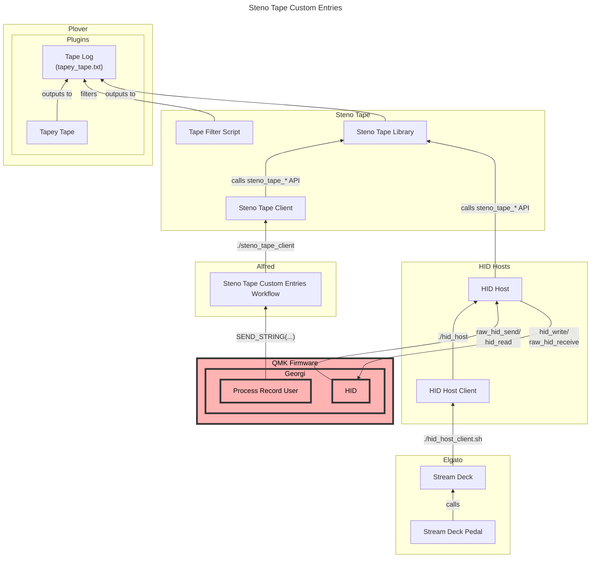

# Georgi Personal Configuration

The major changes in this layout from the [default Georgi QMK layout][] consist
of the following:

- Change the QMK key mnemonics in the gaming layers from using shorter aliases
  to longer, and, in my opinion more legible, [key names][]
- Change some of the keys used in the gaming layer to more closely resemble the
  QWERTY layer in my [Ergodox EZ keymap][]
- Add QMK Combo for the gaming layer that switches back to the steno layer.
  This is meant to mirror the chord used in `sten.c` to switch from the steno
  layer to the gaming layer
- Add configuration for USB [Human Interface Device][] (HID) class
  communications. Specifically, the intention is to use [QMK][]'s [Raw HID][]
  functionality to allow external devices, like a pedal, to perform actions
  internal to the keyboard, like switching keyboard layers
- Use complex hotkey combinations during [Typist][] dash commands that call
  [Alfred][] workflows which log out to [Tapey Tape][]. See [my Dotfiles][] for
  the workflows.

Since I have also made some minor changes to the `sten.c` file of Georgi's
firmware, it's included here. See the `CUSTOMISATION BEGIN` and
`CUSTOMISATION END` comments for specifics.

## Dependencies

The HID-related functionality requires [HIDAPI][] to be installed. If you
are on macOS, this can be done with [Homebrew][] with:

```sh
brew install hidapi
```

## Compile

```sh
cd qmk_firmware
make git-submodule
qmk compile -kb georgi -km paulfioravanti
```

This should result in an `gboards_georgi_paulfioravanti.hex` file being
generated in the `qmk_firmware` root directory.

## Stenography

If you are using a Georgi, I will assume you already know about stenography and
[Plover][].

## Flash Firmware

The tiny button on the left side of the Georgi puts it into bootloader mode so
you can load firmware into it. More details in the [Georgi docs][], or in my
_[Flashing Georgi Firmware][]_ blog post.

Then, open up QMK Toolbox and follow their instructions.

## Steno Tape Custom Entries Architecture



[Alfred]: https://www.alfredapp.com/
[default Georgi QMK layout]: https://github.com/qmk/qmk_firmware/tree/master/keyboards/gboards/georgi
[Ergodox EZ keymap]: ../../../../ergodox_ez/keymaps/paulfioravanti/keymap.c
[Flashing Georgi Firmware]: https://www.paulfioravanti.com/blog/flashing-georgi-firmware/
[HIDAPI]: https://github.com/libusb/hidapi
[Homebrew]: https://brew.sh/
[Human Interface Device]: https://en.wikipedia.org/wiki/USB_human_interface_device_class
[key names]: https://github.com/qmk/qmk_firmware/blob/master/docs/keycodes.md
[Georgi docs]: http://docs.gboards.ca/docs/Georgi-Firmwares/
[my Dotfiles]: https://github.com/paulfioravanti/dotfiles/tree/master/macos/alfred
[Plover]: https://www.openstenoproject.org/plover/
[QMK]: https://qmk.fm/
[Raw HID]: https://docs.qmk.fm/#/feature_rawhid
[Tapey Tape]: https://github.com/rabbitgrowth/plover-tapey-tape
[Typist]: https://github.com/mmaulwurff/typist.pk3
