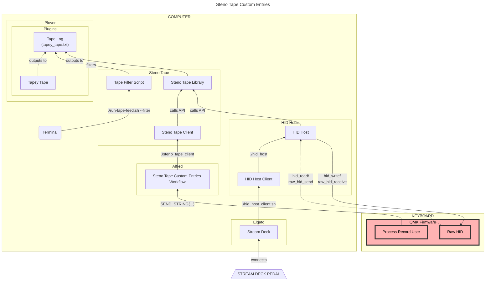

# Multisteno Personal Configuration

The major changes in this layout from the [default Multisteno QMK layout][]
are based on the changes I made for [my Georgi configuration][], and consist of
the following:

- Change the QMK key mnemonics in the QWERTY layers from using shorter aliases
  to longer, and, in my opinion more legible, [key names][]
- Change some of the keys used in the QWERTY layer to more closely resemble the
  QWERTY layer in my [Ergodox EZ keymap][]
- Add configuration for USB [Human Interface Device][] (HID) class
  communications. Specifically, the intention is to use [QMK][]'s [Raw HID][]
  functionality to allow external devices, like a pedal, to perform actions
  internal to the keyboard, like switching keyboard layers
- Use complex hotkey combinations during [Typist][] dash commands that call
  [Alfred][] workflows which log out to [Tapey Tape][]. See [my Dotfiles][] for
  the workflows.

## Dependencies

The HID-related functionality requires [HIDAPI][] to be installed. If you
are on macOS, this can be done with [Homebrew][] with:

```sh
brew install hidapi
```

### Multisteno Firmware

The base Multisteno firmware is not hosted in the [QMK GitHub repo][], and hence
needs to be downloaded directly from its own [Multisteno firmware GitHub
repo][], and then copied into the QMK directory:

```sh
git clone git@github.com:nkotech/Multisteno-Firmware.git
rsync --recursive Multisteno-Firmware/keyboards/ qmk_firmware/keyboards/
```

## Compile

```sh
cd qmk_firmware
make git-submodule
qmk compile -kb noll/multisteno -km paulfioravanti
```

This should result in an `noll_multisteno_paulfioravanti.bin` file being
generated in the `qmk_firmware` root directory.

## Stenography

If you are using a Multisteno, I will assume you already know about stenography
and [Plover][].

## Flash Firmware

See the [Multisteno docs][] for details.

## Steno Tape Custom Entries Architecture



[Alfred]: https://www.alfredapp.com/
[default Multisteno QMK layout]: https://github.com/nkotech/Multisteno-Firmware/blob/main/keyboards/noll/multisteno/keymaps/default/keymap.c
[Ergodox EZ keymap]: ../../../../ergodox_ez/keymaps/paulfioravanti/keymap.c
[HIDAPI]: https://github.com/libusb/hidapi
[Homebrew]: https://brew.sh/
[Human Interface Device]: https://en.wikipedia.org/wiki/USB_human_interface_device_class
[key names]: https://github.com/qmk/qmk_firmware/blob/master/docs/keycodes.md
[Multisteno docs]: https://github.com/nkotech/Multisteno-Firmware
[Multisteno firmware GitHub repo]: https://github.com/nkotech/Multisteno-Firmware
[my Dotfiles]: https://github.com/paulfioravanti/dotfiles/tree/master/macos/alfred
[my Georgi configuration]: ../../../../gboards/georgi/keymaps/paulfioravanti/
[Plover]: https://www.openstenoproject.org/plover/
[QMK]: https://qmk.fm/
[QMK GitHub repo]: https://github.com/qmk/qmk_firmware
[Raw HID]: https://docs.qmk.fm/#/feature_rawhid
[Tapey Tape]: https://github.com/rabbitgrowth/plover-tapey-tape
[Typist]: https://github.com/mmaulwurff/typist.pk3
